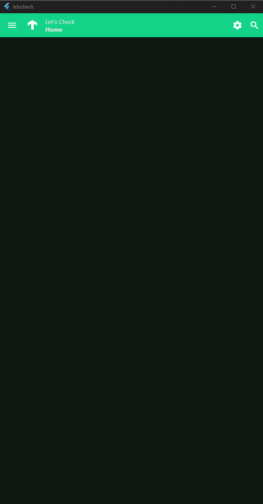

# LetsCheck

LetsCheck is a Checkmk client for Android, iOS, Linux, Mac OS-X and Windows written with the [Flutter SDK](https://flutter.dev/).

[Checkmk](https://checkmk.com/) is a leading tool for Infrastructure and Application Monitoring. Simple configuration, scalable, flexible. Open Source and Enterprise.

## Features

- View Hosts/Services with comments
- Notifications if you have [lql-api](https://github.com/jochumdev/lql-api) installed on you'r Checkmk server
- Search Hosts/Services, use the | symbol to seperated multiple searches

## Download

Get it from [Github Releases](https://github.com/jochumdev/letscheck/releases)

## Demo:



## Preview:

[Available as PWA](https://jochumdev.github.io/letscheck/pwa/) **important** you need proper CORS Headers on you'r Checkmk proxy for a connection to work.

## FAQ

### I don't get notifications on Android?

Visit [dontkillmyapp.com](https://dontkillmyapp.com/) and follow the instructions there for the App "LetsCheck".

### Is lql-api required for this to work?

No, "only" for notifications you need [lql-api](https://github.com/jochumdev/lql-api) installed on the checkmk server.

## Development

**Commit**:

```
git add ./file1 ./file2
./scripts/commit_fix.sh "a bug in component x"
```

**Release**:

- Create changelog, tag and push it
  ```
  ./scripts/release.sh "0.0.99+9763"
  ```
- Create a release on Github
- Wait for Github Actions to publish binaries

## Authors

- [@jochumdev](https://github.com/jochumdev)

## License

Apache 2.0 - Copyright 2025 by [@jochumdev](https://github.com/jochumdev)
